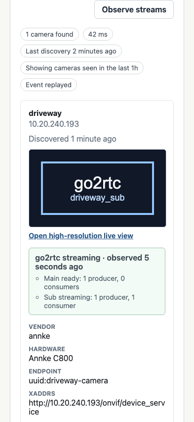
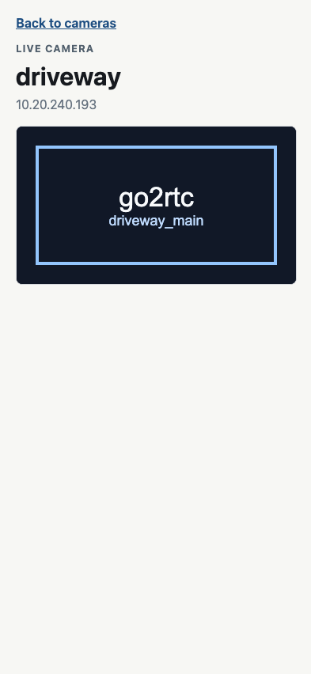
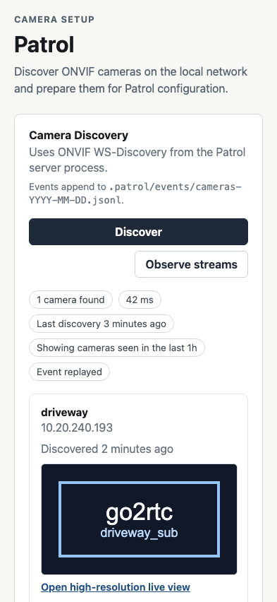

# Test: frontend serves Patrol camera discovery

## Patrol camera discovery panel is visible

**Verifications:**
- [x] Document title is Patrol
- [x] Patrol heading is visible
- [x] Discovery button is visible
- [x] go2rtc observation button is available
- [x] Discovery event log path is shown

---

## Discovered camera is rendered

**Verifications:**
- [x] Camera count is shown
- [x] Driveway camera name is shown
- [x] Camera address is shown
- [x] Discovery age is shown
- [x] First-time setup link opens camera web UI

---

## Camera credentials are accepted

**Verifications:**
- [x] Credentials save status is shown
- [x] Credentialed camera preview is shown through go2rtc
- [x] go2rtc configuration is replayed from events
- [x] Credential request includes camera identity and credentials

---

## go2rtc stream status is reduced from observed events

**Verifications:**
- [x] Camera streaming health is shown
- [x] Per-stream producer and consumer counts are shown

---

## High-resolution live camera view is shown

**Verifications:**
- [x] Live camera route opens from the preview card
- [x] Live stream iframe uses the high-resolution go2rtc stream

---

## Timestamp labels refresh without reload

**Verifications:**
- [x] Last discovery age advances after one minute
- [x] Camera discovery age advances after one minute
- [x] go2rtc observed age advances after one minute
- [x] Credential saved age advances after one minute

---
