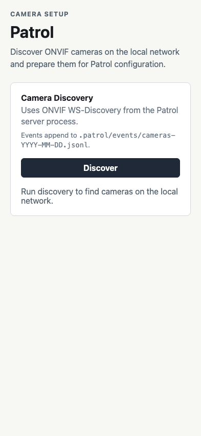
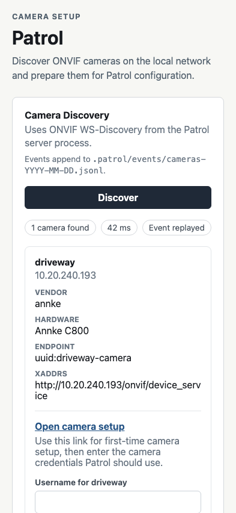
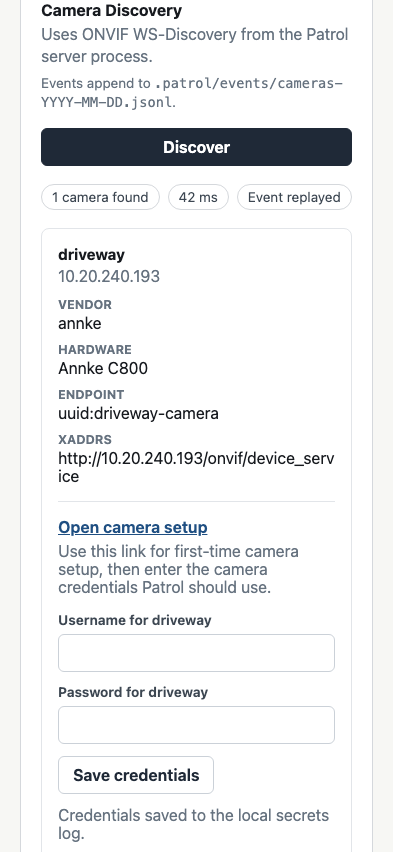

# Test: frontend serves Patrol camera discovery

## Patrol camera discovery panel is visible

**Verifications:**
- [x] Document title is Patrol
- [x] Patrol heading is visible
- [x] Discovery button is visible
- [x] Discovery event log path is shown

---

## Discovered camera is rendered

**Verifications:**
- [x] Camera count is shown
- [x] Driveway camera name is shown
- [x] Camera address is shown
- [x] First-time setup link opens camera web UI

---

## Camera credentials are accepted

**Verifications:**
- [x] Credentials save status is shown
- [x] Credential request includes camera identity and credentials

---
