# Test: frontend serves Patrol camera discovery

## Patrol camera view is visible

**Verifications:**
- [x] Document title is Patrol
- [x] Cameras heading is visible
- [x] Empty camera state points to settings
- [x] Bottom tab buttons are available

---

## Discovery and configuration controls are in settings

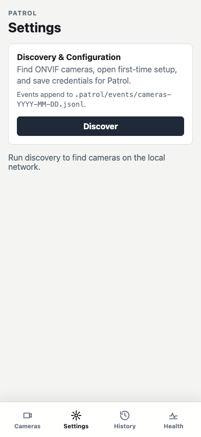

**Verifications:**
- [x] Settings tab is selected
- [x] Discovery button is visible
- [x] Discovery event log path is shown

---

## Discovered camera is rendered

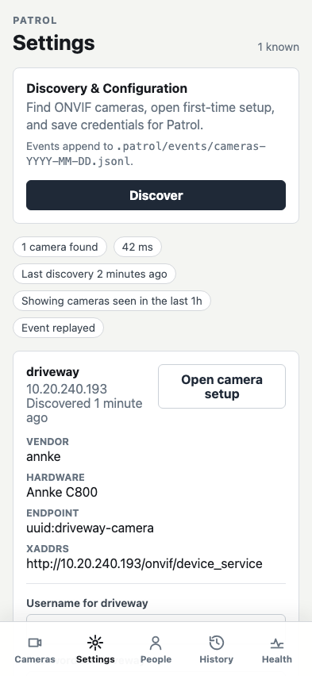

**Verifications:**
- [x] Camera count is shown
- [x] Driveway camera name is shown
- [x] Camera address is shown
- [x] Discovery age is shown
- [x] First-time setup link opens camera web UI

---

## Camera credentials are accepted

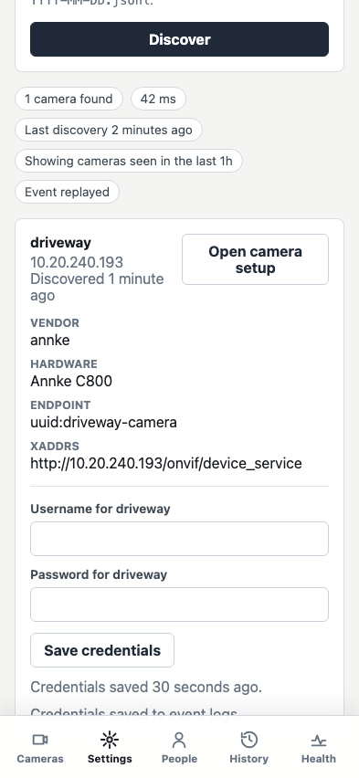

**Verifications:**
- [x] Credentials save status is shown
- [x] Credential request includes camera identity and credentials

---

## Configured cameras show substream previews

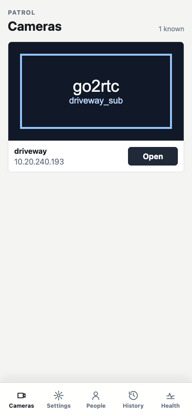

**Verifications:**
- [x] Cameras tab is selected
- [x] Credentialed camera preview is shown through go2rtc

---

## go2rtc configuration status is in system health

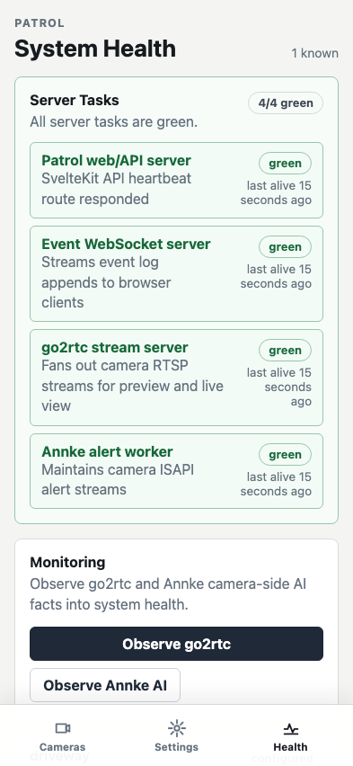

**Verifications:**
- [x] Health tab is selected
- [x] Server task dashboard is green
- [x] All server tasks show last alive times
- [x] go2rtc observation button is available
- [x] Annke AI observation button is available
- [x] go2rtc configuration is replayed from events
- [x] Live event websocket is connected
- [x] Live pushed event is shown in the debug panel

---

## go2rtc stream status is reduced from observed events

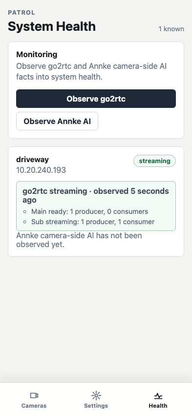

**Verifications:**
- [x] Camera streaming health is shown
- [x] Per-stream producer and consumer counts are shown

---

## Annke camera-side AI status is reduced from observed events

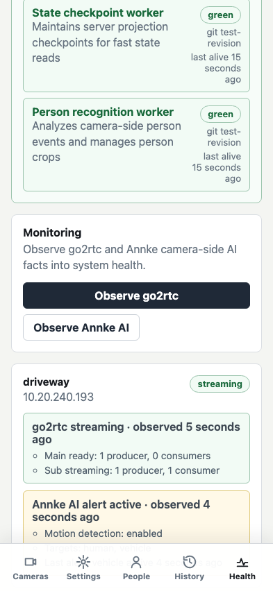

**Verifications:**
- [x] Camera-side AI health is shown
- [x] Motion target types are shown
- [x] Last Annke alert is shown

---

## Observed events are linked to retained recordings

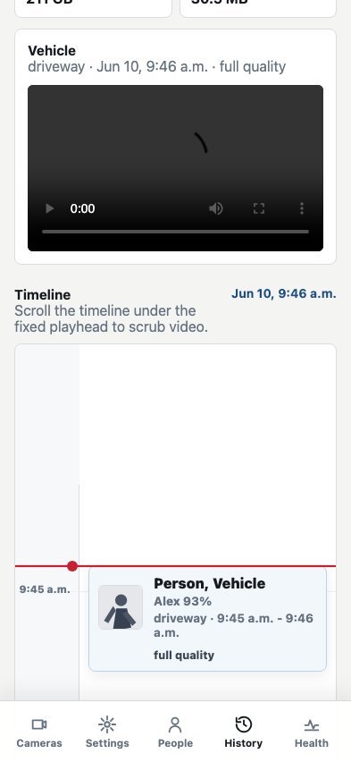

**Verifications:**
- [x] History tab is selected
- [x] Storage estimate is shown
- [x] Nearby events are coalesced in history
- [x] Recording player jumps to the event segment

---

## Unknown person samples can be labeled from high-resolution crops

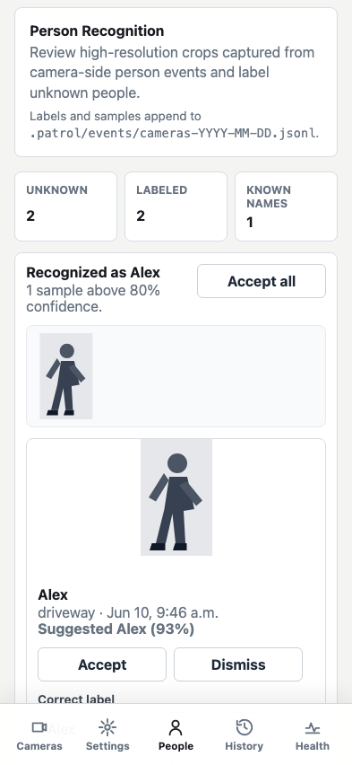

**Verifications:**
- [x] People tab is selected
- [x] Person recognition summary is shown
- [x] Recognized sample can be bulk accepted or corrected

---

## High-resolution live camera view is shown

**Verifications:**
- [x] Live camera route opens from the preview card
- [x] Live stream iframe uses the high-resolution go2rtc stream

---

## Settings timestamp labels refresh without reload

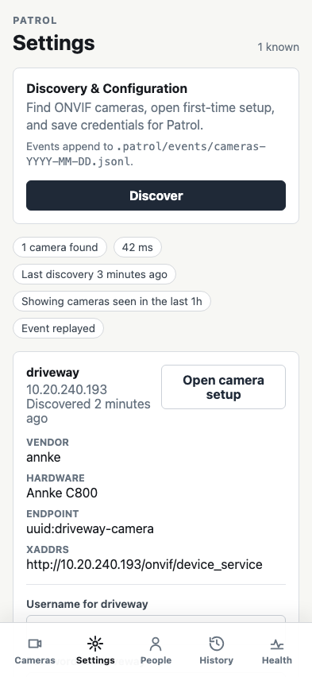

**Verifications:**
- [x] Last discovery age advances after one minute
- [x] Camera discovery age advances after one minute
- [x] Credential saved age advances after one minute

---

## Health timestamp labels refresh without reload

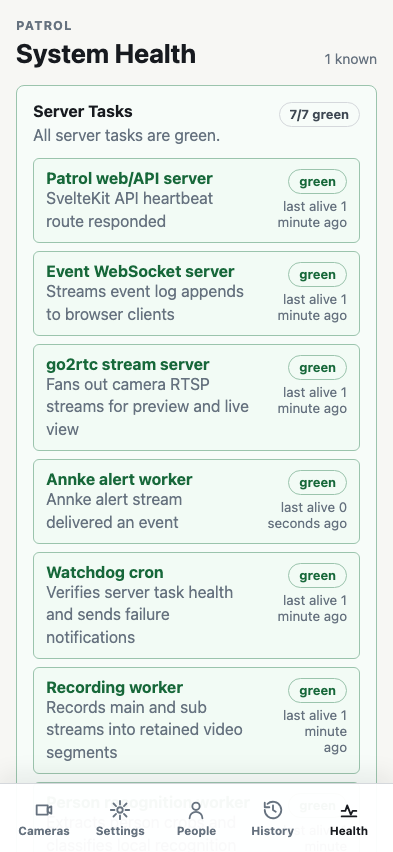

**Verifications:**
- [x] go2rtc observed age advances after one minute
- [x] Annke AI observed age advances after one minute

---
